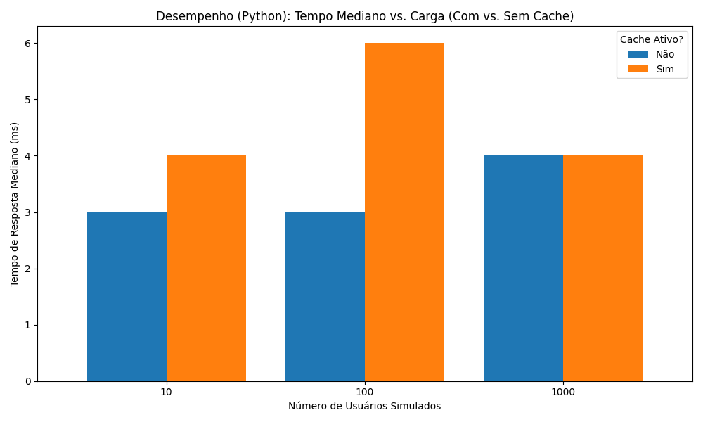
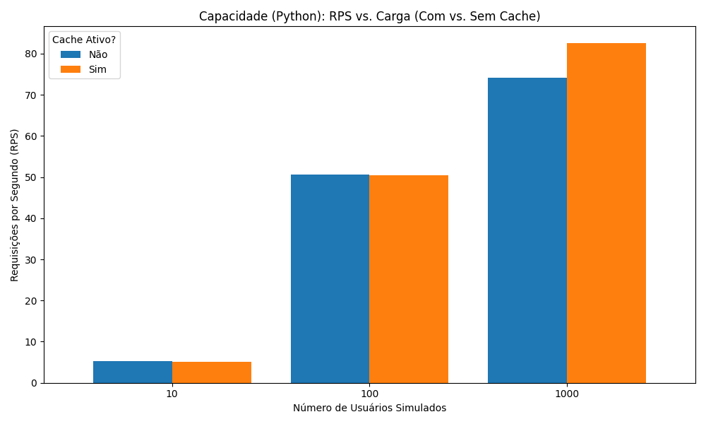
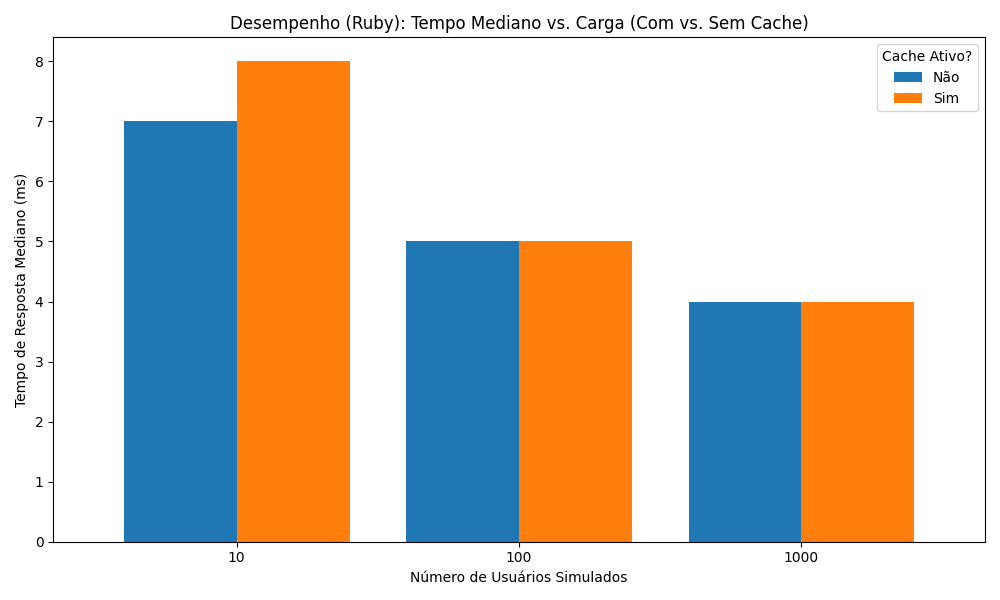
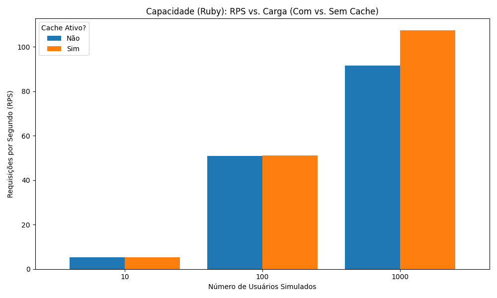

# Atividade 4: Teste de Desempenho da Aplicação Link Extractor

Este projeto realiza testes de desempenho em duas versões (Python e Ruby) da aplicação Link Extractor, avaliando também o impacto do uso de cache (Redis). A ferramenta utilizada para os testes de carga foi o Locust.

## Arquitetura da Aplicação

A aplicação Link Extractor é composta por:
* **Frontend (Web):** Interface em PHP (`./step5/www/` ou `./step6/www/`)
* **Backend (API):** Serviço de extração de links, com versões em:
    * Python (`./step5/api/`)
    * Ruby (`./step6/api/`)
* **Cache:** Serviço Redis para armazenar resultados e acelerar respostas.

A orquestração dos serviços é feita via `docker-compose.yml` (um para cada versão da API).

## Metodologia do Teste

Foram avaliados 4 cenários principais:
1.  API Python com Cache Ativo
2.  API Python sem Cache
3.  API Ruby com Cache Ativo
4.  API Ruby sem Cache

Para cada cenário, foram executados testes de carga simulando **10, 100 e 1000 utilizadores simultâneos** utilizando o Locust. O script `locustfile.py` instruiu cada utilizador virtual a extrair links de uma sequência de 10 páginas diferentes da Wikipédia.

As métricas recolhidas foram o **RPS (Requisições por Segundo)** e o **Tempo de Resposta Mediano (ms)**.

## Ficheiros do Projeto

* **`step5/docker-compose.yml`**: Configuração para iniciar a versão Python (com ou sem cache).
* **`step6/docker-compose.yml`**: Configuração para iniciar a versão Ruby (com ou sem cache).
* **`locustfile.py`**: Script Locust que define o comportamento do utilizador virtual.
* **`gerar_graficos.py`**: Script Python (usando Pandas e Matplotlib) que gera os gráficos a partir dos dados recolhidos.
* **`grafico_*.png`**: Gráficos com os resultados dos testes.

---

## Resultados Finais: Análise dos Gráficos

### Desempenho da API Python (Com vs. Sem Cache)

**Tempo de Resposta Mediano:**

**Requisições por Segundo (RPS):**

**Análise (Python):** Observa-se que a API Python apresentou tempos de resposta medianos extremamente baixos (3-6ms) em quase todos os cenários, mesmo sem cache. Isto sugere que, para as URLs testadas, a extração foi muito rápida. O cache teve um impacto ligeiro na capacidade (RPS) sob stress (1000 utilizadores), aumentando de 74.2 RPS para 82.5 RPS. A taxa de falha também foi ligeiramente menor com o cache ativo (2% vs 3%).

### Desempenho da API Ruby (Com vs. Sem Cache)

**Tempo de Resposta Mediano:**

**Requisições por Segundo (RPS):**

**Análise (Ruby):** A API Ruby também demonstrou tempos medianos muito baixos (4-8ms). O cache teve um impacto mais notável na capacidade sob stress (1000 utilizadores), com o RPS a aumentar de 91.6 (sem cache) para 107.3 (com cache). A taxa de falha manteve-se nos 3% em ambos os cenários de 1000 utilizadores. Comparativamente, a versão Ruby (com cache) pareceu aguentar uma carga ligeiramente superior à versão Python (com cache) neste teste específico.